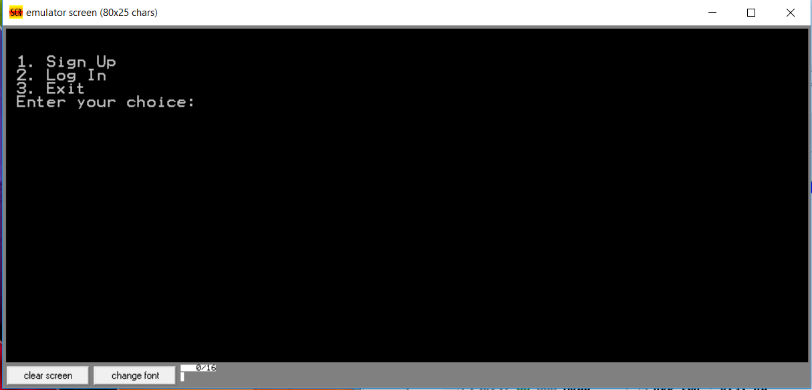
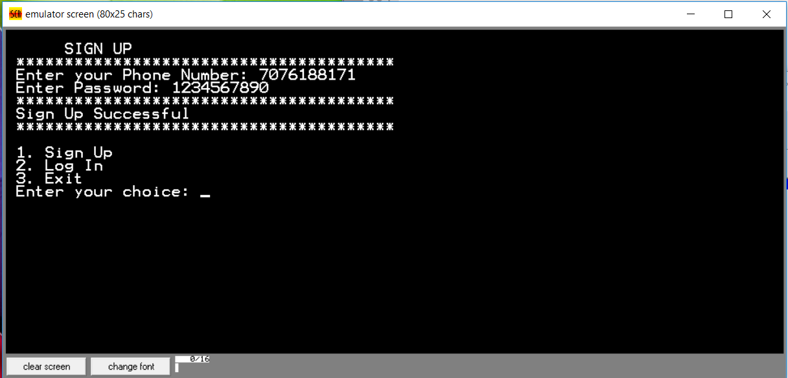
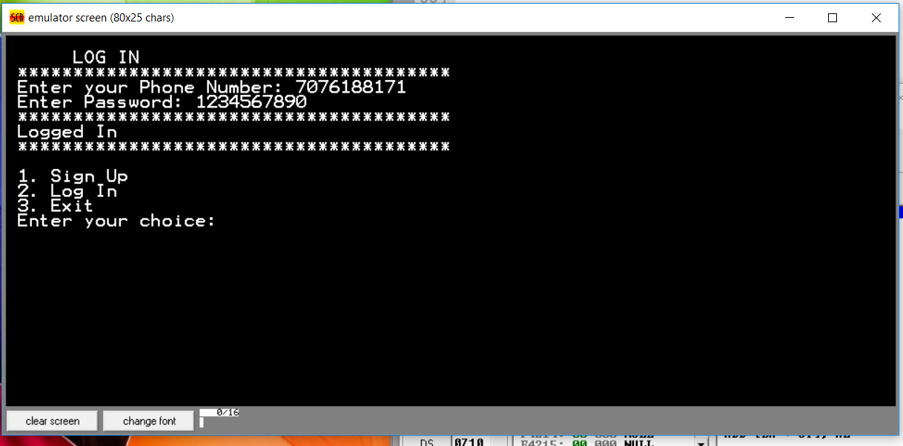
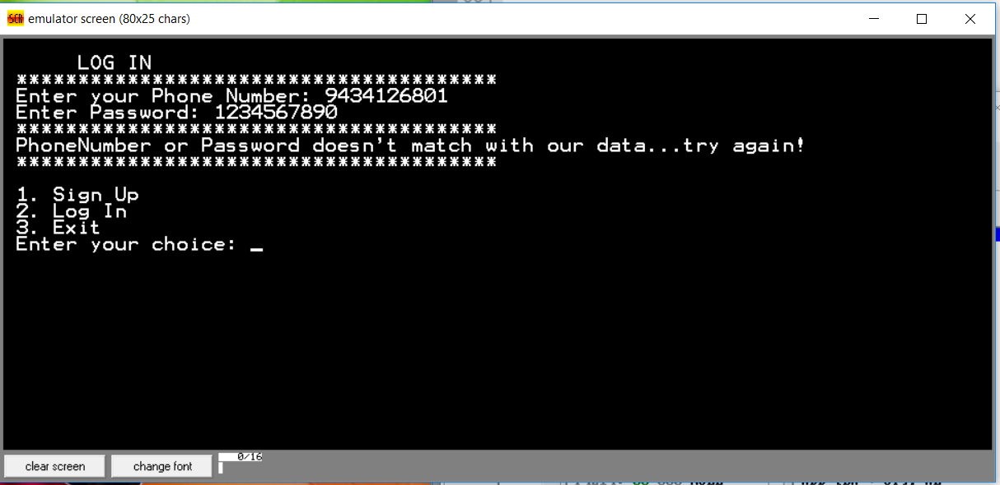

# 8086-LOGIN-PAGE
A 8086 program for Login and Signup implementation

It takes your phone number as username and has a 10 digit password as your Signup credentials.  
You can Login using the same credentials that you provided using Sign up.  

  

 

 

 
